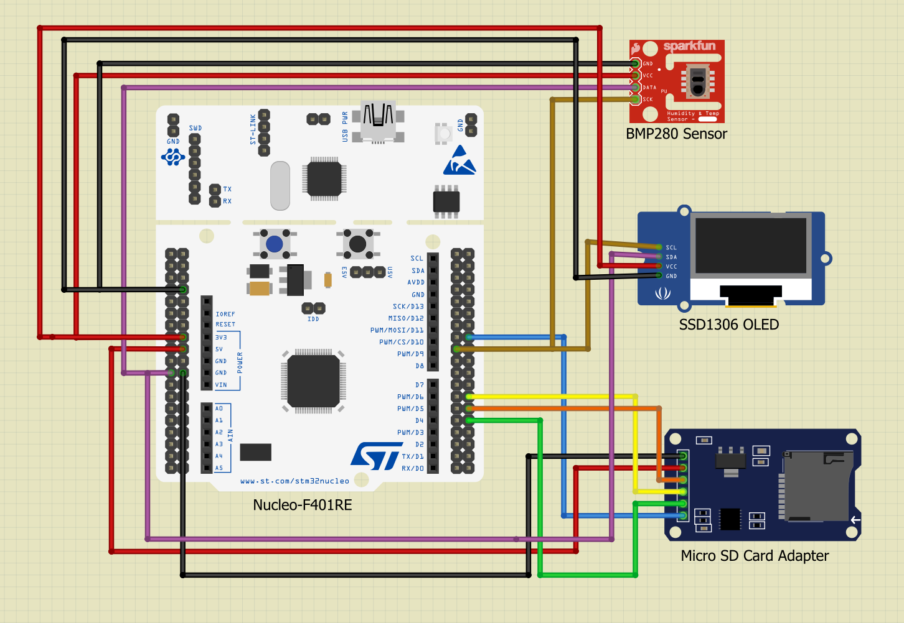

# Modular STM32 Weather Station

A modular STM32F401RE (NUCLEO-F401RE) weather station with FreeRTOS, BMP280 (temperature/pressure), SSD1306 (OLED), SD logging (FatFs), and UART CSV streaming. The codebase is organized for clarity, modularity, and future growth.


## Contents
- [Overview](#overview)
- [Screenshots and Diagrams](#screenshots-and-diagrams)
- [Technical Specifications](#technical-specifications)
- [Wiring and Connection Diagrams](#wiring-and-connection-diagrams)
- [Software and Dependencies](#software-and-dependencies)
- [Project Structure](#project-structure)
- [Build and Flash Instructions](#build-and-flash-instructions)
- [Operation Instructions](#operation-instructions)
- [Realtime UART Plotting](#realtime-uart-plotting)
- [Extending the Project](#extending-the-project)

## Overview
- MCU: STM32F401RE (NUCLEO-F401RE board)
- RTOS: FreeRTOS (CMSIS-RTOS v2)
- Sensors: BMP280 (temperature in °C, pressure in hPa)
- Display: SSD1306 128x64 over I2C
- Storage: microSD over SPI (FatFs)
- Logging: CSV to SD (log.txt) and identical CSV via UART (115200)
- Architecture: app, bsp, os, with headers split into app/, bsp/, system/

## Screenshots and Diagrams
Place your images under docs/images/ and update names below.
- Device: docs/images/device_front.jpg
- OLED sample: docs/images/oled_sample.png
- System block: docs/images/system_block.png
- Wiring: docs/images/wiring.bmp280_ssd1306_sd.png

## Technical Specifications
- Power: USB 5V on NUCLEO (on-board 3.3V regulator)
- Interfaces
  - I2C1 @ 400 kHz (BMP280, SSD1306)
  - SPI2 (SD): prescaler 32, mode 0
  - UART2 @ 115200-8-N-1 (CSV stream)
- CSV format: tick_ms,temperature_C,pressure_hPa
  - Example: 11010,25.85,982.16
- Default periods
  - Sensor read: 500 ms
  - Display/UART/SD: event-driven per new sample (via queues)

## Wiring and Connection Diagrams




I2C (BMP280, SSD1306)
- 3.3V -> VCC
- GND -> GND
- PB8 (I2C1_SCL) -> SCL
- PB9 (I2C1_SDA) -> SDA

SPI (MicroSD)
- 3.3V -> VCC
- GND -> GND
- PB13 (SPI2_SCK) -> SCK
- PB14 (SPI2_MISO) -> MISO
- PB15 (SPI2_MOSI) -> MOSI
- CS -> CS_Pin defined in Core/Inc/system/main.h

On-board
- LD2, B1 as per CubeMX defaults

## Software and Dependencies
- Toolchain: STM32CubeIDE (GCC for ARM)
- HAL/CMSIS: STM32CubeF4
- Middlewares: FreeRTOS, FatFs
- Optional (PC): Python 3.9+ with pyserial, matplotlib for plotting
  - Install: python -m pip install --upgrade pip && python -m pip install pyserial matplotlib

## Project Structure
```
Meteo_v1/
  Core/
    Inc/
      app/        # App headers (public APIs for app layer)
      bsp/        # Drivers headers (sensors, display, sd)
      system/     # Cube/HAL system headers (main.h, it, hal_conf, RTOS cfg)
    Src/
      app/        # App tasks (Sensor, Display, UART, SDLog), main.c
      os/         # FreeRTOS glue (user area)
      bsp/
        display/  # SSD1306, fonts
        sensors/  # BMP280
        sd/       # SD SPI, DiskIO, helpers
      ...         # HAL/Cube sources: it, timebase, syscalls, system init
    Startup/      # Startup assembly
  Drivers/        # CMSIS + HAL
  Middlewares/    # FreeRTOS, FatFs
  FATFS/          # FatFs Cube glue (App/Target)
  tools/
    uart_plot.py  # Realtime UART CSV plotter
  STM32F401RETX_FLASH.ld, STM32F401RETX_RAM.ld
  Meteo_v1.ioc
  README.md
```

Design notes
- Headers split (Core/Inc/app|bsp|system) and sources grouped by module for maintainability.
- CubeIDE includes these folders recursively; internal refactors do not require IDE path changes.

## Build and Flash Instructions
STM32CubeIDE
1. Import/Open project Meteo_v1.
2. Build (Debug): Project -> Build Project.
3. Connect NUCLEO via USB (ST-Link) and Debug/Run to flash.

Command line (optional)
- Prefer CubeIDE managed build on Windows. Makefiles under Debug/ are generated by IDE.

## Operation Instructions
- Power NUCLEO via USB; insert a FAT32 microSD.
- On boot:
  - Sensor task samples BMP280 (I2C, guarded by mutex).
  - Display task renders temperature/pressure.
  - SD task appends CSV lines to log.txt.
  - UART task streams identical CSV at 115200.
- CSV fields: tick_ms (since boot), temp_C, press_hPa.

## Realtime UART Plotting
Temperature (red, °C) and Pressure (blue, hPa) vs time (mm:ss). Data is streamed from the STM32 at 115200 baud in CSV format and plotted with an optional EMA smoothing for more stable visuals.


The chart shows live telemetry parsed from CSV lines sent over UART: tick_ms, temperature_C, pressure_hPa. The X‑axis is time since the plot started (mm:ss). The left Y‑axis is temperature; the right Y‑axis is pressure. The window dynamically pans, keeping the latest N seconds visible. Smoothing (–smooth) can be adjusted to reduce jitter without hiding trends.

1) Install deps: python -m pip install pyserial matplotlib
2) Run (Windows example): python tools/uart_plot.py --port COM6 --baud 115200 --smooth 0.2
- X axis: mm:ss from script start
- Red: temperature (°C), Blue: pressure (hPa)
- Options: --window 120 (seconds), --smooth 0..0.95 (EMA, 0 disables)

## Extending the Project
- New sensors: add driver in Core/Src/bsp/<sensor>/, header in Core/Inc/bsp/, publish data via queues.
- New outputs: create a consumer task subscribing to the sample queues (e.g., radio/MQTT via UART).
- Storage: extend Core/Src/bsp/sd/sd_functions.c (file formats, rotation, etc.).

---
Maintainer notes
- RTOS uses queues (no shared global sample), mutexes for I2C/UART/SD, and a semaphore for SD readiness.
- Include paths in .cproject updated for Core/Inc/app|bsp|system.
